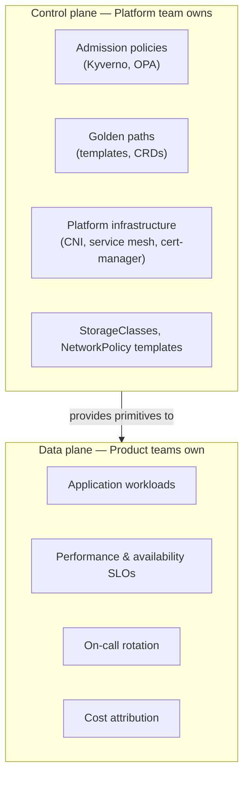
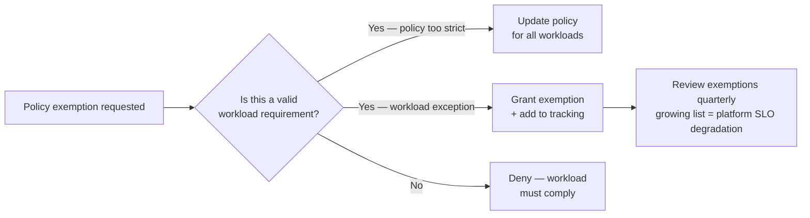
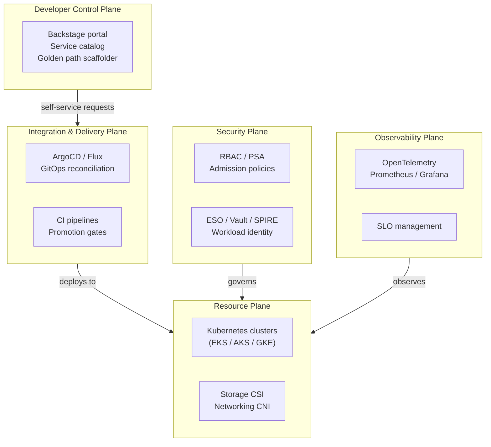

# Platform as a Product

## The control plane / data plane ownership split

The most important structural decision for a platform team is where its responsibility boundary is. Platform engineering must own the control plane — the policies, abstractions, and infrastructure primitives that govern what's allowed. Product teams own the data plane — the behavior of their workloads, their performance, their availability.

**Platform team should NOT be on-call for application performance**. If a product team's service is slow, the platform team investigates whether the infrastructure layer (node pressure, CNI, storage IOPS) is contributing — but the product team owns the investigation and fix. This boundary is what prevents the platform team from becoming a bottleneck.

## Why ticket-based models fail

A platform team that operates on a ticket queue (developers request namespaces, request StorageClass access, request secret permissions) hits a scaling wall fast:

- 3 platform engineers supporting 40 product teams = 13:1 ratio
- Each platform change requires platform team involvement
- Platform becomes the critical path for product team productivity
- Platform engineers spend all time on operational requests, no time on platform improvements

**Self-service is the scaling mechanism.** The platform team invests in automation (golden paths, CRDs, admission policies) that allows product teams to self-provision within guardrails, without platform team involvement for routine operations.

The ticket queue remains only for requests that require policy exceptions or new platform capabilities — not for day-to-day provisioning.

## Platform adoption metrics that matter

Vanity metrics (uptime, ticket closure rate) don't indicate whether the platform is reducing developer friction. Meaningful metrics:

| Metric | What it measures | Target |
|---|---|---|
| Time to first production deployment | Onboarding experience end-to-end | Benchmark, then improve |
| Self-service completion rate | Are developers finishing golden path flows or abandoning? | >90% completion |
| Infrastructure provisioning latency | How long from CR submission to resource ready? | <5 min for standard requests |
| Golden path vs shadow IT ratio | Are developers using platform paths or bypassing them? | Track trend |
| Policy exemption count | Growing exemption list = failing platform SLO | Decreasing trend |

**Shadow IT detection**: platform teams can use eBPF-based auditing to identify traffic originating from workloads not deployed through approved platform channels — namespace labels not matching platform-managed namespaces, service accounts not created by the golden path template. This surfaces how much workload is bypassing the platform and where the gaps are.

## Internal SLAs and error budgets

Platform infrastructure has its own SLOs, measured against developer-facing outcomes:

- **API server availability**: 99.9% uptime for control plane operations
- **GitOps reconciliation latency**: P95 time from commit to deployment < 5 minutes
- **Admission webhook latency**: P99 < 500ms (slow webhooks delay all API server requests)
- **Secret rotation availability**: 99.95% (secret injection must not block pod startup)

Error budgets apply to policy enforcement as well. The number of standing admission policy exemptions is a platform SLO indicator — each exemption represents a workload that can't comply with current platform standards. A growing exemption list indicates the platform is too restrictive relative to real workload requirements, or that the enforcement timeline was too aggressive.

## Feature request management

Product team feature requests to the platform arrive in two categories:

1. **New golden paths or CRD types**: a team needs a new infrastructure primitive (new database type, new message queue service) not in the current catalog. Handle via formal platform roadmap: evaluate reuse potential, design the abstraction, build and publish.

2. **One-off customizations**: a team wants a specific configuration that doesn't map to any existing abstraction. Handle via self-service escape hatches (raw Kubernetes resources within guardrails) — not by manually configuring for them.

The platform team should never become a human configuration applier. Every request that requires a platform engineer to manually touch YAML is a signal that an abstraction is missing.

**Cost physics of platform investment**: the productivity return on platform investment becomes favorable at 50–100 engineers. Below this threshold, the overhead of maintaining Backstage, GitOps controllers, admission webhooks, and golden paths often exceeds the productivity gained. Smaller organizations should apply a subset: golden path templates and GitOps are high-ROI at any scale; Backstage and CRD-based platform APIs pay off at larger scale.

## CNCF Platform Engineering Maturity Model

The CNCF TAG App Delivery maturity model assesses platform teams across five dimensions: **Investment, Adoption, Interfaces, Operations, and Measurement**. Teams progress through four levels:

| Level | Name | Investment model | Adoption driver | Operational state |
|---|---|---|---|---|
| 1 | Provisional | Tiger teams / volunteers | Necessity — no standard exists | Manual, variable, unsupported |
| 2 | Operationalized | Dedicated team (cost center) | External pressure / management mandate | Reactive technical delivery |
| 3 | Scalable | Platform as a product (value-based investment) | Intrinsic pull — self-service reduces developer friction | One-click self-service; DORA/SPACE metrics automated |
| 4 | Optimizing | Core ecosystem enabler | Platform is the standard way of working | Product teams contribute back; zero-downtime upgrades |

**Level 1 → 2 transition**: create a dedicated team with a funded backlog. The signal that a team is stuck at Level 1 is engineer burnout from maintaining ad-hoc tooling alongside feature work.

**Level 2 → 3 transition**: the platform moves from "teams use it because they're told to" to "teams use it because it's faster than doing it themselves." The metric: self-service completion rate — teams finishing golden path flows without opening a ticket. If completion rate is below 80%, the platform is at Level 2 operationally even if the team considers itself "product-oriented."

**Level 3 → 4 transition**: platform capabilities become specialized enough that domain experts (security team, data platform team) build on top of the platform rather than alongside it. Product engineers submit PRs to the platform's golden path templates. The platform team becomes an enabler of specialized contributions, not the sole builder.

**Cost threshold**: Level 3 platform practices (Backstage, CRD-based APIs, automated DORA instrumentation) require 50–100+ engineers to justify the investment. Below this threshold, teams should focus on Level 2 capabilities — golden path templates and GitOps deliver Level 2 value at any scale.

## The 5-plane reference architecture

The CNCF TAG App Delivery Platforms Working Group and Humanitec reference architecture both describe a 5-plane model for what an IDP must provide. This maps directly to this guide's modules:

| Plane | This guide | Key modules |
|---|---|---|
| Developer Control Plane | Module 10 | Backstage, golden paths, service catalog, platform API design |
| Integration & Delivery Plane | Module 05 | ArgoCD vs Flux, app-of-apps, promotion pipelines, progressive delivery |
| Security Plane | Module 04 | RBAC, PSA, secrets management, runtime security |
| Resource Plane | Modules 01–03, 06, 09 | Cluster architecture, networking, autoscaling, storage |
| Observability Plane | Module 07 | OpenTelemetry, Prometheus, SLO design |

The 5-plane model is useful as an audit checklist: a platform that lacks a well-defined Security Plane is operating below Level 2 maturity regardless of how good its Developer Control Plane is.

See [backstage-and-developer-portal.md](backstage-and-developer-portal.md) for the IDP as the interface for this model.
See [platform-api-design.md](platform-api-design.md) for CRDs as the self-service mechanism.
