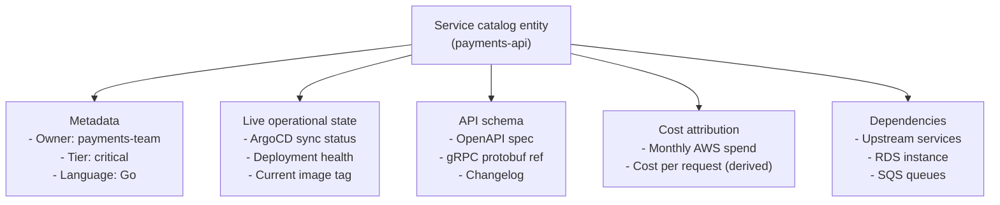
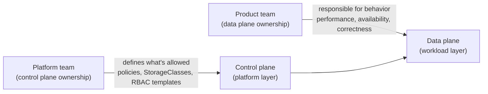

# Service Catalog Design

## What the catalog is for

The service catalog answers operational questions: what services exist, who owns them, what state they're currently in, what they depend on, and what they cost. At scale, without a catalog, incident response is slowed by "who owns this thing?" and cost attribution requires manual AWS tag archaeology.

A production catalog is an operational tool, not a documentation index. The distinction matters for what you put in it and how you keep it current.

## What belongs in the catalog

Beyond basic metadata, a production catalog entry for a service should surface:

**Live operational state** is what separates a useful catalog from a documentation site. Integrate ArgoCD's API to surface real-time sync status and health. If the catalog shows a service's deployment is degraded, developers know before opening a separate tool.

**Cost attribution** requires consistent AWS resource tagging from the start. Services that weren't tagged correctly at creation require manual remediation — enforce tagging via admission control from day one.

**API schema links** enable consumers to understand what a service offers without asking the owning team. This is particularly valuable for platform services that many teams depend on.

## Automated discovery: the only viable population strategy

Manual population of catalog entries fails at scale. Teams create new services without registering them. Entries become stale as services are renamed or decommissioned.

**Three automated discovery mechanisms:**

1. **Git-based ingestion**: require every service repository to contain a `catalog-info.yaml`. Backstage's catalog backend polls Git and ingests all entities automatically. New services are discovered as soon as the repo is created (the golden path template creates `catalog-info.yaml` by default).

2. **Kubernetes annotation scraping**: the Backstage Kubernetes plugin reads annotations from running Deployments and Services, matching them to catalog entities. Provides live pod counts, resource utilization, and health status without additional configuration.

3. **ArgoCD integration**: ArgoCD Applications link directly to catalog entities via the `argocd/app-name` annotation, surfacing deployment state and sync history.

The "ghost town" failure — catalog that looks comprehensive but isn't trusted because data is stale — is a consequence of relying on any manual step in the population pipeline.

## Ownership model

Ownership in the catalog has two distinct layers:

**Platform team owns the control plane**: what StorageClasses exist, what NetworkPolicy templates are available, what admission policies apply, what golden paths are offered. Platform team is NOT on-call for application performance.

**Product teams own the data plane**: how their workloads behave, whether they scale correctly, whether their endpoints are healthy. Product teams are on-call for their own services.

The catalog makes this split explicit: the `owner` field on every entity should reference the product team. Platform-managed components (cert-manager, external-secrets, ArgoCD) are owned by the platform team group.

## Avoiding the ghost town

Signs a catalog is becoming a ghost town:
- Services in the catalog that were decommissioned months ago
- Owner fields pointing to teams that no longer exist
- No correlation between catalog health status and actual production incidents

**Lifecycle management**:
- Require `catalog-info.yaml` updates to pass a schema validation step in CI
- Surface catalog entity staleness (last synced, entity not updated in >90 days) as a metric in the platform team's own SLO
- Automate removal: if a Git repo is archived, the catalog entity should be automatically deprecated

A catalog that developers trust is one that's demonstrably accurate. One bad experience ("I checked the catalog, owner was wrong, cost me 30 minutes in an incident") destroys trust that takes months to rebuild.

See [backstage-and-developer-portal.md](backstage-and-developer-portal.md) for Backstage configuration that integrates these catalog sources.
See [platform-as-a-product.md](platform-as-a-product.md) for ownership model and platform team topology.
