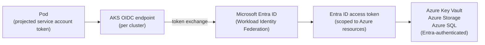
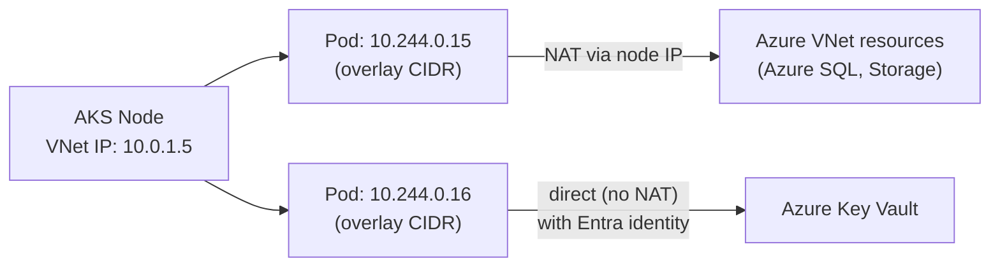

# AKS-Specific Patterns

## Workload identity: Azure Workload Identity

Azure Workload Identity federates Kubernetes ServiceAccounts with Microsoft Entra ID (formerly Azure AD) using OIDC federation — the Azure-native equivalent of EKS Pod Identity.



**Configuration**: three components must be aligned — the Managed Identity (or App Registration), the Federated Credential binding, and the ServiceAccount annotation.

```bash
# Create user-assigned managed identity
az identity create --name payments-api-identity --resource-group my-rg

# Add federated credential: trust tokens from this AKS cluster + namespace + SA
az identity federated-credential create \
  --name payments-api-fed \
  --identity-name payments-api-identity \
  --resource-group my-rg \
  --issuer "$(az aks show --name my-cluster --resource-group my-rg --query oidcIssuerProfile.issuerUrl -o tsv)" \
  --subject "system:serviceaccount:payments:payments-api" \
  --audience api://AzureADTokenExchange
```

```yaml
# ServiceAccount with workload identity annotation
apiVersion: v1
kind: ServiceAccount
metadata:
  name: payments-api
  namespace: payments
  annotations:
    azure.workload.identity/client-id: "<managed-identity-client-id>"
```

**OIDC issuer per cluster**: like EKS IRSA, Azure Workload Identity is issuer-scoped. Each AKS cluster has a unique OIDC issuer URL, and federated credentials reference the specific issuer. Fleet-wide managed identities require updating federated credentials for each cluster — the same sprawl problem as IRSA. There is no cluster-object-scoped trust equivalent to EKS Pod Identity in AKS.

## Networking: Azure CNI Overlay

Classic Azure CNI assigns pod IPs from the VNet address space directly — pods consume VNet CIDR, causing address exhaustion in large clusters (same problem as VPC CNI at scale).

**Azure CNI Overlay** (recommended for new clusters) assigns pod IPs from a separate overlay network that doesn't consume VNet address space:



Pods communicate within the cluster using overlay IPs. Outbound to VNet resources uses NAT through the node IP. This decouples pod IP space from VNet addressing — clusters can scale to thousands of pods without planning VNet CIDR allocations.

## Advanced Container Networking Services (ACNS)

ACNS is AKS's managed Cilium offering — eBPF-based networking that replaces kube-proxy and iptables with an eBPF data plane. Capabilities:

- **Network observability**: Hubble-based flow visibility without deploying a separate observability stack
- **Advanced NetworkPolicy**: FQDN-based egress policies, L7 policy enforcement
- **Performance**: eBPF path reduces per-packet processing overhead vs iptables

ACNS is a managed add-on — AKS handles version compatibility with the cluster. Enabling Cilium-based networking via ACNS is the AKS equivalent of GKE Dataplane V2.

```bash
az aks create --name my-cluster --resource-group my-rg \
  --network-plugin azure \
  --network-plugin-mode overlay \
  --network-dataplane cilium    # enables ACNS
```

## Managed add-ons

AKS provides managed add-ons for common platform components. Key add-ons:

| Add-on | Equivalent | Notes |
|---|---|---|
| `azure-keyvault-secrets-provider` | external-secrets with ASO | CSI driver for Key Vault secrets; supports auto-rotation |
| `monitoring` | Prometheus + Grafana | Azure Monitor integration; managed Prometheus workspace |
| `open-service-mesh` | Istio/Linkerd | Deprecated in favor of Istio add-on |
| `istio` | Istio | Managed Istio; AKS handles upgrades |
| `ingress-appgw` | ALB Ingress Controller | Application Gateway Ingress Controller |

Managed add-ons are updated by Azure in coordination with the AKS version lifecycle — the same model as EKS managed add-ons.

## Notable AKS limitation: external OIDC authenticator

EKS and GKE both support configuring an external OIDC provider as the primary `--oidc-issuer-url` for human authentication to the Kubernetes API server. This enables a consistent `kubectl` login flow using corporate SSO (Okta, Azure AD with custom claims).

AKS does not support replacing the primary Kubernetes API server authenticator with an external OIDC provider. Human access is through Azure AD integration (kubelogin + Azure AD groups mapped to Kubernetes RBAC). This works well if your identity provider is Entra ID, but creates friction for organizations with non-Azure identity providers.

See [cloud-portability.md](cloud-portability.md) for what differs between AKS, EKS, and GKE at the portability boundary.
See [../04-Security/rbac-design.md](../04-Security/rbac-design.md) for RBAC patterns that work across cloud-specific identity models.
