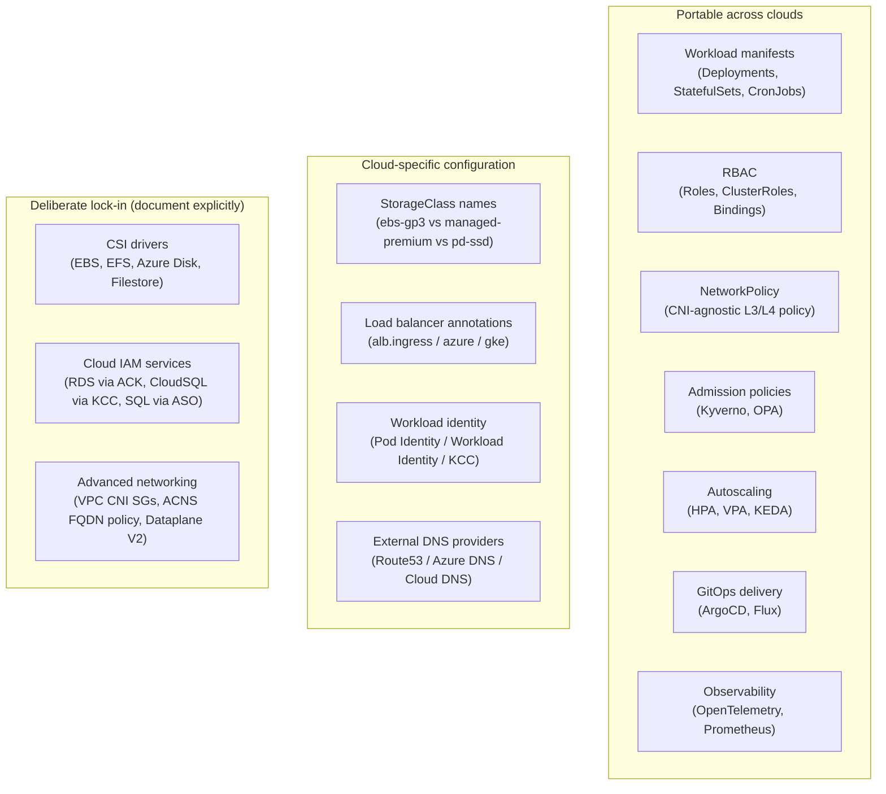

# Cloud Portability

## The portability model

This guide's central principle: workloads should be portable across conformant Kubernetes clusters. Cloud-specific primitives are configuration, not architecture. The design questions start with "what does the workload need?" not "what does the cloud provider offer?"

In practice, portability is not binary. Some layers are truly portable; others necessarily tie to the cloud provider. The decision is deliberate: choose the portability boundary consciously and document where you accept cloud lock-in.



## What is truly portable

**Workload manifests**: Deployments, StatefulSets, CronJobs, Services, ConfigMaps, Secrets written to standard Kubernetes APIs run unchanged on EKS, AKS, and GKE. This is the portability guarantee.

**RBAC**: Role, ClusterRole, RoleBinding, ClusterRoleBinding are standard Kubernetes APIs. The only cloud-specific element is how humans authenticate (OIDC provider configuration) — the RBAC objects themselves are portable.

**NetworkPolicy**: the standard Kubernetes NetworkPolicy API is implemented by every major CNI (VPC CNI, Cilium, Calico, Azure CNI). Policies written to the standard API are portable. FQDN-based policies and L7 policies require CNI-specific extensions.

**Autoscaling**: HPA, VPA, and KEDA work identically across clouds. KEDA scalers for cloud-specific sources (SQS, Azure Service Bus, Pub/Sub) are cloud-specific but the KEDA ScaledObject API is portable.

**GitOps**: ArgoCD and Flux operate identically across cloud providers. Multi-cluster management via ApplicationSets or Flux's ClusterSelector is cloud-neutral.

**OpenTelemetry**: the OTel SDK and Collector are cloud-neutral. The exporter endpoint (AWS X-Ray, Azure Monitor, Google Cloud Trace) is cloud-specific.

## Where portability breaks

### Workload identity

The identity mechanism is the most significant portability break point:

| Cloud | Mechanism | Kubernetes API | Trust scope |
|---|---|---|---|
| EKS | Pod Identity / IRSA | SA annotation | Cluster object / OIDC issuer |
| AKS | Azure Workload Identity | SA annotation | OIDC issuer (Entra federation) |
| GKE | Workload Identity | SA annotation | Project Workload Identity Pool |

The annotation key and value format differ per cloud. An application's ServiceAccount must be configured differently per cloud. Mitigation: abstract the annotation injection via a Helm values file or Kustomize overlay per cluster, keeping the base manifest cloud-neutral.

### StorageClass names

StorageClasses are named per-cluster. `ebs-gp3` doesn't exist on GKE; `pd-ssd` doesn't exist on EKS. PVCs that hardcode a `storageClassName` are not portable.

```yaml
# Non-portable: hardcodes EKS StorageClass
spec:
  storageClassName: ebs-gp3

# Portable pattern: use a logical alias resolved per cluster
spec:
  storageClassName: platform-block-storage    # defined as a StorageClass on each cluster
```

Provision a set of logical StorageClass names (`platform-block-storage`, `platform-shared-storage`) as wrappers around the cloud-specific provisioner on each cluster. Workloads reference the logical names; the underlying CSI driver is cloud-specific configuration.

### Load balancer annotations

AWS ALB, Azure Application Gateway, and GKE Ingress use different annotation schemas for the same features. An Ingress manifest with AWS ALB annotations doesn't deploy correctly on GKE.

**Mitigation**: use Gateway API (`HTTPRoute`, `Gateway`) with a cloud-neutral schema where the cloud-specific GatewayClass is configured per cluster. See [../03-Networking/ingress-vs-gateway-api.md](../03-Networking/ingress-vs-gateway-api.md).

### Cloud infrastructure provisioning

ACK (EKS), Azure Service Operator / ASO (AKS), and Config Connector / KCC (GKE) each use different CRD APIs to provision cloud resources:

```yaml
# EKS — ACK
apiVersion: rds.services.k8s.aws/v1alpha1
kind: DBCluster
# AKS — Azure Service Operator
apiVersion: dbforpostgresql.azure.com/v1alpha1api20210601
kind: FlexibleServer
# GKE — Config Connector
apiVersion: sql.cnrm.cloud.google.com/v1beta1
kind: SQLInstance
```

These are deliberately non-portable. Crossplane provides a portable layer on top — write one `XPostgresInstance` Composition that delegates to the cloud-specific provider. Whether this abstraction is worth the Crossplane operational overhead depends on your multi-cloud maturity.

## Deliberate lock-in: accept and document

Not all cloud-specific dependencies are worth abstracting away. The cost of maintaining abstraction layers must be weighed against the likelihood of cloud migration.

**Accept lock-in when:**
- The cloud-specific feature provides significant operational value (EKS Security Groups for Pods, GKE Dataplane V2 observability)
- Cloud migration is not a realistic near-term scenario
- The abstraction layer adds more complexity than the lock-in removes

**Document lock-in explicitly** in your platform's architecture decision records:
- "We use EBS-backed StorageClasses; migrating to another cloud requires remapping StorageClass names and migrating PVC data"
- "We use ACK for RDS provisioning; moving to GKE requires rewriting database provisioning CRDs to use Config Connector"

The portability boundary should be a conscious decision, not an accident of implementation.

See [eks-identity-and-networking.md](eks-identity-and-networking.md), [aks-patterns.md](aks-patterns.md), and [gke-patterns.md](gke-patterns.md) for the cloud-specific details at each portability break point.
