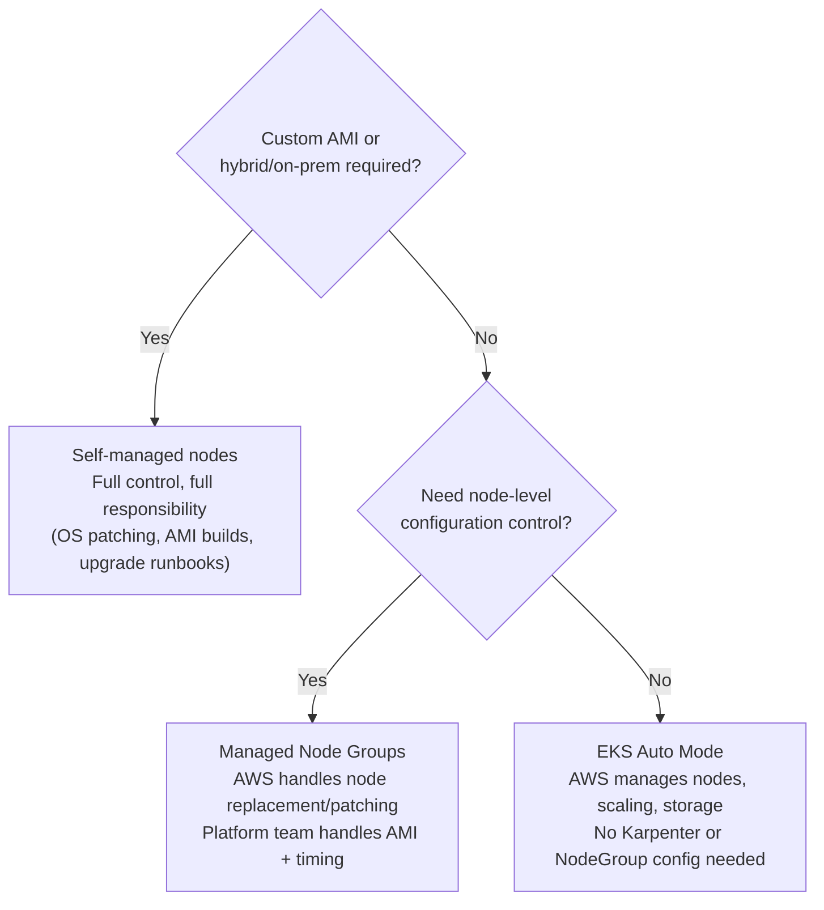
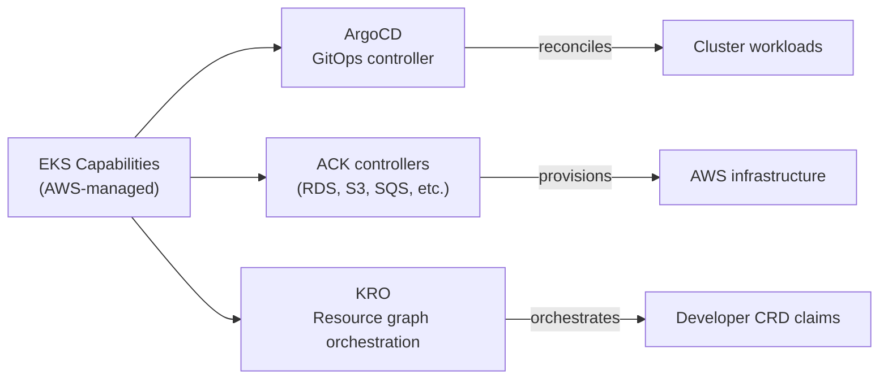

# EKS Compute and Add-on Management

## Compute tier selection

EKS offers three compute modes. The decision is how much operational control you need versus how much operational overhead you can eliminate.



### EKS Auto Mode

Auto Mode is the no-ops compute tier introduced in 2024. AWS fully manages:

- Node provisioning and lifecycle (backed by Karpenter internally)
- Node AMI updates and patching
- EBS storage provisioning for PVCs
- Node termination and replacement

Platform teams configure workload requirements (resource requests, node selectors, topology constraints) and Auto Mode handles the underlying EC2 orchestration. There is no node group or Karpenter NodePool to maintain.

**When Auto Mode is appropriate**: most production workloads that don't require custom node configuration. The operational savings are significant — a platform team managing 10 clusters in Auto Mode spends substantially less time on compute lifecycle than one managing equivalent Karpenter NodePools.

**Limitations**: Auto Mode uses AWS-managed instance types and AMIs. Workloads requiring specific kernel modules, custom GPU drivers, or non-standard OS configurations need Managed Node Groups or self-managed nodes.

### Managed Node Groups

AWS handles node replacement events (spot interruptions, AZ rebalancing) and applies OS patches via AMI updates. Platform teams retain control over:

- AMI selection (Amazon Linux 2023 vs Bottlerocket vs custom)
- Instance type selection and on-demand/spot mix
- Upgrade timing (when to roll the node group to a new AMI)

Managed Node Groups integrate with Karpenter — the preferred compute autoscaler. See [../06-Autoscaling/karpenter-vs-cluster-autoscaler.md](../06-Autoscaling/karpenter-vs-cluster-autoscaler.md) for Karpenter NodePool design.

### Self-managed nodes

Full control over the node lifecycle — AMI builds, OS patching, kubelet configuration. The "hidden tax" is substantial: dedicated engineering time for building and testing custom AMIs, monitoring OS CVEs, and executing upgrade runbooks. Only justified for:

- Custom AMIs with specific kernel modules or drivers
- EKS Anywhere (hybrid on-prem nodes)
- Regulatory requirements mandating specific OS configurations

## EKS add-on management

EKS add-ons are managed components that AWS keeps version-compatible with the cluster Kubernetes version. Relevant add-ons:

| Add-on | Purpose | Notes |
|---|---|---|
| `aws-ebs-csi-driver` | EBS PVC provisioning | Required for dynamic EBS volumes; needs IAM via Pod Identity |
| `aws-efs-csi-driver` | EFS PVC provisioning | Needs IAM via Pod Identity |
| `vpc-cni` | Pod networking (VPC-native IPs) | Required; see [eks-identity-and-networking.md](eks-identity-and-networking.md) |
| `coredns` | Cluster DNS | Managed by add-on; don't manage separately |
| `kube-proxy` | Service networking | Managed by add-on |
| `aws-guardduty-agent` | Runtime threat detection | DaemonSet; adds overhead |

Add-ons are updated independently of the cluster — patch the add-on without upgrading Kubernetes. This decouples security patches from cluster upgrades.

```yaml
# Add-on configuration via eksctl or Terraform
addons:
- name: aws-ebs-csi-driver
  version: latest
  serviceAccountRoleARN: arn:aws:iam::123456789:role/ebs-csi-pod-identity
  resolveConflicts: OVERWRITE
```

## EKS Capabilities: AWS-managed platform components

EKS Capabilities are AWS-managed cluster-level features that install and maintain platform components (ArgoCD, ACK controllers, KRO) without requiring the platform team to manage controller infrastructure.



AWS handles version upgrades for Capability components in coordination with the EKS version lifecycle. Platform teams configure the capabilities but don't manage their operational lifecycle — the same model as EKS add-ons but for higher-level platform components.

See [eks-identity-and-networking.md](eks-identity-and-networking.md) for Pod Identity configuration needed by most add-ons.
See [../10-Platform-API/platform-api-design.md](../10-Platform-API/platform-api-design.md) for KRO and ACK patterns these capabilities enable.
