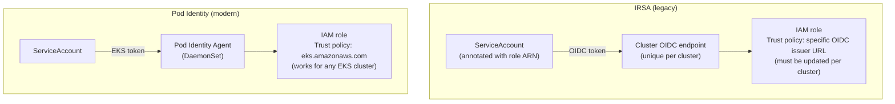
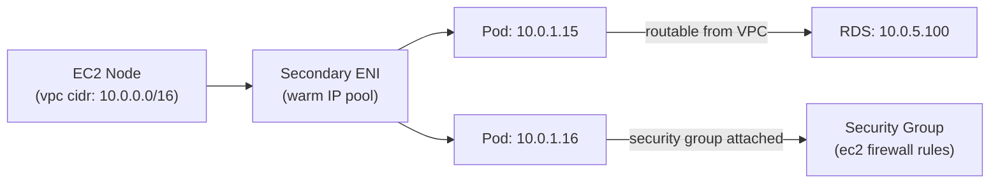

# EKS Identity and Networking

## Workload identity: Pod Identity vs IRSA

Both mechanisms allow pods to assume IAM roles without static credentials. They differ in how trust is scoped and managed across a fleet.



### IRSA (IAM Roles for Service Accounts)

**How it works**: each cluster registers a unique OIDC issuer URL with AWS IAM. IAM role trust policies reference the specific OIDC issuer URL. The cluster's OIDC token is validated against the IAM role before credentials are issued.

**The fleet sprawl problem**: in a 20-cluster fleet, each cluster has its own OIDC issuer URL. Every IAM role that needs to be used across clusters must have all 20 OIDC issuer URLs in its trust policy. Adding a new cluster means updating every shared IAM role's trust policy — a scaling problem.

IRSA is still required for:
- **Fargate nodes** — Pod Identity doesn't support Fargate
- **Windows nodes** — Pod Identity doesn't support Windows

### Pod Identity (preferred for EC2 Linux)

**How it works**: trust is bound to the EKS cluster resource object in AWS, not an OIDC issuer URL. The Pod Identity Agent (DaemonSet) intercepts credential requests and exchanges them for IAM credentials via the EKS service.

```yaml
# IAM role trust policy for Pod Identity
{
  "Effect": "Allow",
  "Principal": {
    "Service": "pods.eks.amazonaws.com"    # same for all EKS clusters
  },
  "Action": ["sts:AssumeRole", "sts:TagSession"],
  "Condition": {
    "StringEquals": {
      "aws:SourceAccount": "123456789012"
    },
    "ArnLike": {
      "aws:SourceArn": "arn:aws:eks:us-east-1:123456789012:cluster/*"  # or specific cluster
    }
  }
}
```

A single IAM role with this trust policy works for any EKS cluster in the account. For fleet-wide platform roles (EBS CSI driver, cert-manager, external-secrets), this eliminates per-cluster IAM policy updates.

**Pod Identity association** (binds a role to a specific ServiceAccount in a cluster):
```bash
aws eks create-pod-identity-association \
  --cluster-name my-cluster \
  --namespace kube-system \
  --service-account ebs-csi-controller-sa \
  --role-arn arn:aws:iam::123456789012:role/ebs-csi-role
```

The association is stored in EKS — not in the cluster as an annotation. Changing the role doesn't require modifying Kubernetes objects.

## VPC CNI and pod networking

Amazon VPC CNI assigns pod IPs directly from the VPC CIDR — pods are first-class VPC citizens. This is EKS's default networking model and differs from overlay network CNIs (Calico, Cilium, Weave).

**Implications:**
- Pods have routable IPs — accessible from other VPC resources without NAT
- Pod IPs consume VPC CIDR space — IP exhaustion is a real scaling concern in large clusters
- Security Groups for Pods: attach EC2 security groups directly to pods



### Security Groups for Pods

VPC CNI's most EKS-specific feature: attach EC2 Security Groups to pods instead of (or in addition to) Kubernetes NetworkPolicy. This allows:
- Reusing existing EC2-based firewall rules for pod-level access control
- Simpler integration with RDS, ElastiCache, and other AWS services that use Security Group-based access control
- Compliance requirements that mandate Security Group use

```yaml
apiVersion: vpcresources.k8s.aws/v1beta1
kind: SecurityGroupPolicy
metadata:
  name: payments-sg-policy
  namespace: payments
spec:
  podSelector:
    matchLabels:
      app: payments-api
  securityGroups:
    groupIds:
    - sg-0abc123def456       # existing EC2 security group
```

**Limitation**: Security Groups for Pods require branch ENIs, which are only supported on Nitro instance types with limited ENI capacity per instance. On smaller instances, the number of pods that can use Security Groups for Pods is constrained.

### IP address management at scale

VPC CNI's IP-from-VPC-CIDR model consumes address space quickly. Each node pre-warms a pool of IPs for fast pod startup — even pods not yet scheduled consume IP addresses on nodes.

**Mitigation options:**
- Use VPC CNI with custom networking: pods use secondary CIDR ranges (RFC1918 /8 ranges) instead of the primary VPC CIDR, relieving exhaustion in large clusters
- Use prefix delegation: assign /28 prefixes to nodes instead of individual IPs, supporting more pods per node with fewer ENI attachments

See [eks-compute-and-addons.md](eks-compute-and-addons.md) for compute tier configuration that interacts with the VPC CNI warm pool behavior.
See [../03-Networking/cni-selection.md](../03-Networking/cni-selection.md) for alternatives to VPC CNI (Cilium overlay on EKS) when VPC CIDR exhaustion is a concern.
