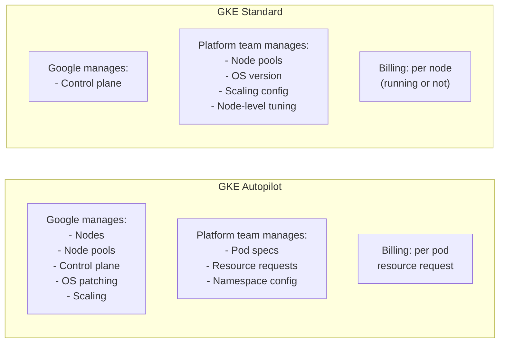
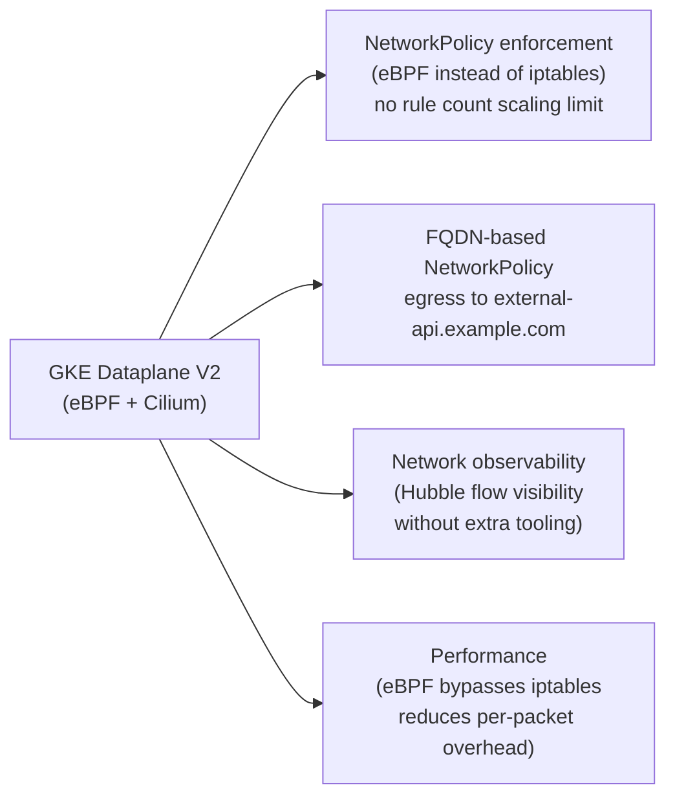

# GKE-Specific Patterns

## Autopilot vs Standard mode

GKE offers two modes with fundamentally different operational models.



### GKE Autopilot

Autopilot is Google's closest equivalent to EKS Auto Mode. Google manages the entire node layer — provisioning, patching, scaling, and replacement. Pods are billed based on resource requests (CPU, memory, GPU), not on running nodes. Idle node capacity is not charged.

**When Autopilot is appropriate**: most stateless workloads without custom node requirements. The billing model incentivizes accurate resource requests — over-requesting wastes money directly, not just capacity.

**Autopilot constraints**:

- No DaemonSets (Google manages the equivalent functionality)
- No privileged containers
- Limited node customization — custom kernel parameters and third-party drivers are not supported
- HostPath volumes not allowed

### GKE Standard mode

Full control over node pool configuration. Required for:

- Workloads needing custom kernel modules or GPU drivers
- DaemonSets for platform agents (eBPF tools, security sensors)
- Specific instance types not in Autopilot's catalog
- Workloads that require `hostPath` or privileged containers

Standard mode with node auto-provisioning is the Standard-mode equivalent of Autopilot's auto-scaling: GKE automatically creates and deletes node pools based on workload requirements.

## GKE Workload Identity

GKE's native mechanism for mapping Kubernetes ServiceAccounts to GCP IAM service accounts. GKE was the first major cloud to implement this pattern (before EKS IRSA or AKS Workload Identity).

```bash
# Bind a Kubernetes ServiceAccount to a GCP IAM service account
gcloud iam service-accounts add-iam-policy-binding \
  payments-api@my-project.iam.gserviceaccount.com \
  --role roles/iam.workloadIdentityUser \
  --member "serviceAccount:my-project.svc.id.goog[payments/payments-api]"
```

```yaml
# Kubernetes ServiceAccount annotation
apiVersion: v1
kind: ServiceAccount
metadata:
  name: payments-api
  namespace: payments
  annotations:
    iam.gke.io/gcp-service-account: payments-api@my-project.iam.gserviceaccount.com
```

Like EKS IRSA and AKS Workload Identity, trust is bound to the project's Workload Identity Pool — scoped per GKE cluster. Fleet-wide IAM bindings require adding each cluster's Workload Identity pool to the IAM policy.

## GKE Dataplane V2

GKE Dataplane V2 replaces the iptables-based kube-proxy networking with an eBPF-based data plane (built on Cilium). This is the default for new GKE clusters.

**What Dataplane V2 provides:**



**iptables scaling limitation**: classic kube-proxy iptables rules are O(n) lookup — with thousands of services and endpoints, iptables traversal becomes measurable. eBPF's hash map lookups are O(1). At scale (1000+ services), this is a real performance difference.

**Enabling network visibility**: Dataplane V2 includes Hubble (Cilium's observability layer) for network flow visibility — see which pods are communicating, identify unexpected traffic patterns, and debug NetworkPolicy denies — without deploying a separate observability stack.

## Config Connector (KCC)

Config Connector allows platform teams to manage GCP resources (Cloud SQL, Cloud Storage, Pub/Sub, Memorystore) as Kubernetes CRDs using `kubectl apply`.

```yaml
apiVersion: sql.cnrm.cloud.google.com/v1beta1
kind: SQLInstance
metadata:
  name: payments-db
  namespace: payments
spec:
  databaseVersion: POSTGRES_15
  region: us-central1
  settings:
    tier: db-custom-4-15360
    backupConfiguration:
      enabled: true
      pointInTimeRecoveryEnabled: true
    availabilityType: REGIONAL    # multi-AZ equivalent
```

KCC is the GCP-native equivalent of AWS ACK. The resource is reconciled by a KCC controller running in the cluster — state drift is detected and corrected like any other Kubernetes object.

**Workload Identity for KCC**: KCC controllers need GCP IAM permissions to manage cloud resources. Configure a dedicated GCP service account with the required permissions, bound via Workload Identity to the KCC controller's Kubernetes ServiceAccount.

## Storage: GCP Persistent Disk and Filestore

GKE's CSI ecosystem maps directly to the same access mode decisions as EKS and AKS:

| Driver | Access mode | AZ scope | Equivalent |
|---|---|---|---|
| Compute Engine PD CSI | RWO | Single zone | EBS CSI / Azure Disk |
| Filestore CSI | RWX | Regional | EFS / Azure Files NFS |
| Cloud Storage FUSE CSI | RWO / ROX | Regional | S3 CSI (same caveats) |

**GCP Persistent Disk** is the block storage equivalent of EBS. Available types:

```yaml
apiVersion: storage.k8s.io/v1
kind: StorageClass
metadata:
  name: gcp-ssd
provisioner: pd.csi.storage.gke.io
volumeBindingMode: WaitForFirstConsumer    # zone co-location — same as EBS
parameters:
  type: pd-ssd              # pd-standard (HDD), pd-ssd, pd-balanced, pd-extreme
  replication-type: none    # none = zonal; regional-pd = synchronous multi-zone replication
allowVolumeExpansion: true
```

**Regional Persistent Disk** (`replication-type: regional-pd`) synchronously replicates data across two zones in a region. This is GCP's unique differentiator — no equivalent exists in EBS or Azure Disk. Use for stateful workloads that need fast failover across zones without backup-and-restore cycles.

**Filestore** provides managed NFS at three tiers: Basic (zonal, for dev/test), Enterprise (regional HA, for production), and High Scale (large-scale parallelism for HPC workloads). Enterprise tier provides synchronous multi-zone availability — equivalent to EFS's regional availability model.

```yaml
apiVersion: storage.k8s.io/v1
kind: StorageClass
metadata:
  name: gcp-filestore
provisioner: filestore.csi.storage.gke.io
parameters:
  tier: enterprise      # Basic (zonal), Standard, Premium, Enterprise (HA)
  network: default
```

**Cloud Storage FUSE**: same caveats as S3 CSI — POSIX semantics not guaranteed, avoid for workloads that expect atomic renames or file locking. Use the Cloud Storage SDK directly with Workload Identity for production object storage access.

See [../09-Storage/csi-driver-selection.md](../09-Storage/csi-driver-selection.md) for the access mode decision framework that applies identically to GCP storage.

## Human access: Envoy-based Identity Service

GKE supports configuring an OIDC provider for `kubectl` authentication via an in-cluster Envoy-based Identity Service. This enables consistent human access using corporate SSO (Okta, Google Identity) mapped to Kubernetes RBAC — the same model EKS supports natively via `--oidc-issuer-url`.

```bash
# Configure GKE Identity Service for OIDC
gcloud container clusters update my-cluster \
  --update-addons GcpFilestoreCsiDriver=ENABLED \
  --identity-provider-config identity-provider-config.yaml
```

This capability differentiates GKE (and EKS) from AKS, which does not support external OIDC as the primary cluster authenticator.

See [cloud-portability.md](cloud-portability.md) for where GKE patterns break cross-cloud portability.
See [../04-Security/iam-federation.md](../04-Security/iam-federation.md) for workload identity patterns across all three clouds.
